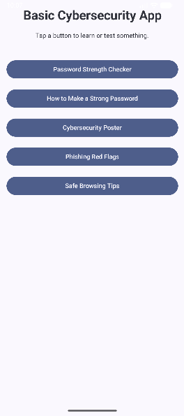
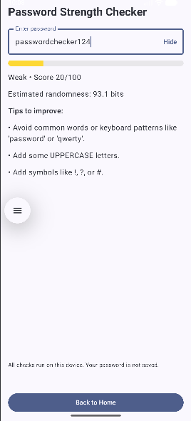
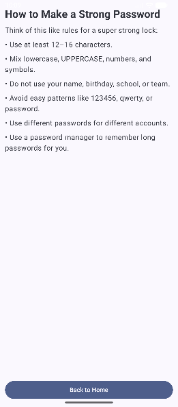
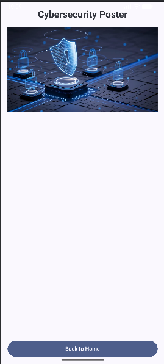
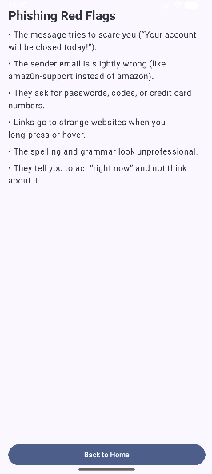
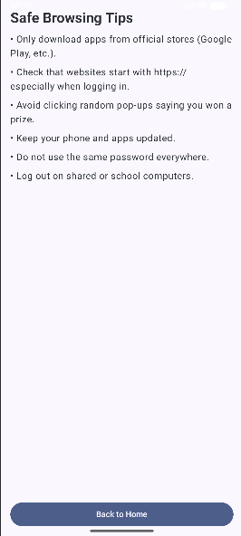

# 🔐 Basic Cybersecurity App  
A simple, beginner-friendly Android app built with **Kotlin** and **Jetpack Compose** that teaches essential cybersecurity concepts.  
The app includes a **password strength checker**, cybersecurity education pages, safe browsing tips, and phishing awareness — all in one clean, modern UI.

---

## 📱 Features

### 🏠 Home Screen
A clean navigation hub with five learning modules:

1. **Password Strength Checker**
2. **How to Make a Strong Password**
3. **Cybersecurity Poster (Image)**
4. **Phishing Red Flags**
5. **Safe Browsing Tips**

---

## 🔑 Password Strength Checker
✔ Real-time scoring (0–100)  
✔ Visual strength bar  
✔ Entropy-based randomness estimate  
✔ Feedback on how to improve the password  
✔ All processing done **on-device** (nothing is stored)

---

## 🧠 Educational Pages  
The app includes non-technical explanations suitable for students, beginners, and anyone learning cybersecurity:

### 📘 How to Make a Strong Password
- Minimum length guidance  
- Mix of characters  
- Avoiding personal info  
- Password manager tips  

### 🖼 Cybersecurity Poster  
Displays a visual image of typing in 'Cybersecurity' into google. 

### 🚩 Phishing Red Flags
- Identifying fake emails  
- Suspicious links  
- Urgency tactics  
- Grammar and sender tricks  

### 🛡 Safe Browsing Tips
- HTTPS importance  
- Avoiding pop-ups  
- Updating devices  
- Protecting accounts on shared computers  

---
# 🔰 Screenshots

## 🏠 Home Screen

## 🔐 Password Strength Checker

## 🧠 How to Make a Strong Password

## 🖼 Cybersecurity Poster

## 🚩 Phishing Red Flags

## 🛡 Safe Browsing Tips

---

## 🧰 Tech Stack

- **Kotlin**
- **Jetpack Compose**
- **Material 3**
- **Navigation Compose**
- **Local password analysis engine**
- **Android Studio (Electric Eel/Flamingo or later)**

---

## 📂 Project Structure

